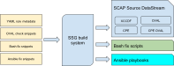

# Evaluate-scap

## What is Evaluate-scap

*"Evaluate-scap"* is a script that evaluates the SCAP profile rules
from the [scap-security-guide v0.1.63](https://github.com/ComplianceAsCode/content/releases/tag/v0.1.63)
on your linux machine.

*"Evaluate-scap"* download all rules from the [scap-security-guide](https://github.com/ComplianceAsCode/content),
generates a "remediation" script and guide for each SCAP profile.

## What is SCAP Security Guide

*"SCAP Security Guide"* is a security policy written
in a form of SCAP documents.
The security policy created in SCAP Security Guide
covers many areas of computer security and provides the best-practice solutions.
The guide consists of rules with very detailed description
and also includes proven remediation scripts,
optimized for target systems.
SCAP Security Guide, together with OpenSCAP tools,
can be used for auditing your system in an automated way.

SCAP Security Guide implements security guidances
recommended by respected authorities, namely PCI DSS, STIG, and USGCB.
SCAP Security Guide transforms these security guidances into a machine readable format
which then can be used by OpenSCAP to audit your system.
SCAP Security Guide builds multiple security baselines
from a single high-quality SCAP content.
The DISA STIG for RHEL 6,
which provides required settings for US Department of Defense systems,
is one example of a baseline created from this guidance.
If your systems must to comply to these baselines,
you simply select appropriate profile from SCAP Security Guide.

Security policies in SCAP Security Guide are available
for various operating systems and other software

- Fedora
- Red Hat Enterprise Linux
- Mozilla Firefox
- and others

SCAP Security guide is a dynamic open source project,
which means that many organizations interested in computer security share their efforts
and collaborate on security policies contained in SCAP Security guide.
It has usage in Military and Intelligence communities, healthcare,
aviation, telecom and other industries.
And above all, SCAP Security guide is available for download free.

### What is the purpose of Scap-security-guide project

*"The purpose of Scap-security-guide project"* is to create
*security policy content* for various platforms ...

- Red Hat Enterprise Linux  
- Fedora  
- Ubuntu  
- Debian  
- SUSE Linux Enterprise Server (SLES)  
- ... as well as products  
- Firefox  
- Chromium  
- JRE  
- ... We aim to make it as easy as possible to write new and maintain existing  

[Open SCAP Website](https://www.open-scap.org/security-policies/scap-security-guide)

## What is Security automation content in SCAP, Bash, Ansible, and other formats

 &nbsp; &nbsp;

&nbsp; &nbsp;

*"SCAP content"* refers to documents  in the *XCCDF*, *OVAL* and
*Source DataStream* formats.  These documents can be presented
in different forms and by different organizations to meet their security
automation and technical implementation needs.
For general use, we recommend *Source DataStreams* because
they contain all the data you need to evaluate and put machines
into compliance.
The datastreams are part of our release ZIP archives.

*"Ansible content"* refers to Ansible playbooks generated from security
profiles.
These can be used both in check-mode to evaluate compliance,
as well as run-mode to put machines into compliance.
We publish these on *Ansible Galaxy* as well as in release ZIP archives.

*"Bash fix files"* refers to *Bash* scripts generated from security
profiles.
These are meant to be run on machines to put them into compliance.
We recommend using other formats but understand that for
some deployment scenarios bash is the only option.

### Why

We want multiple organizations to be able to efficiently develop security
content.
By taking advantage of the powerful build system of this project,
we avoid as much redundancy as possible.

The build system combines the easy-to-edit YAML rule files with OVAL checks,
Ansible task snippets, Bash fixes, and other files. Templating is provided
at every step to avoid boilerplate. Security identifiers
(CCE, NIST ID, STIG, ...) appear in all of our output formats but are all
sourced from the YAML rule files.

We understand that depending on your organization's needs you may need
to use a specific security content format. We let you choose.

[Scap-security-guide GitHub](https://github.com/ComplianceAsCode/content)

## A little bit of history

The *"ComplianceAsCode"* project started in 2011 as a collaboration between
United States Government agencies and commercial operating system vendors.
The original name was *"SCAP Security Guide"*, commonly abbreviated as SSG.
The original scope was to create SCAP datastreams. Over time, it grew into the
biggest open-source beyond-SCAP content project.

The next few years saw the introduction of not just government-specific security
profiles but also commercial, such as PCI-DSS and CIS.

Later, the industry starts moving towards different security content formats,
such as Ansible, Puppet, and Chef InSpec. The community reacted by evolving the
tooling and helped transform SSG into a more general-purpose security content
project. This change happened over time in 2017 and 2018. In September 2018, we
decided to change the name of the project to `ComplianceAsCode`,
in order to avoid confusion.

We envision that the future will be format-agnostic. That's why opted for an
abstraction instead of using XCCDF for the input format.

## Further reading

The SSG homepage is [https://www.open-scap.org/security-policies/scap-security-guide/](https://www.open-scap.org/security-policies/scap-security-guide/).

- [SSG User Manual](docs/manual/user_guide.adoc)
- [SSG Developer Guide](https://complianceascode.readthedocs.io/)
- [Compliance As Code Blog](https://complianceascode.github.io/)
